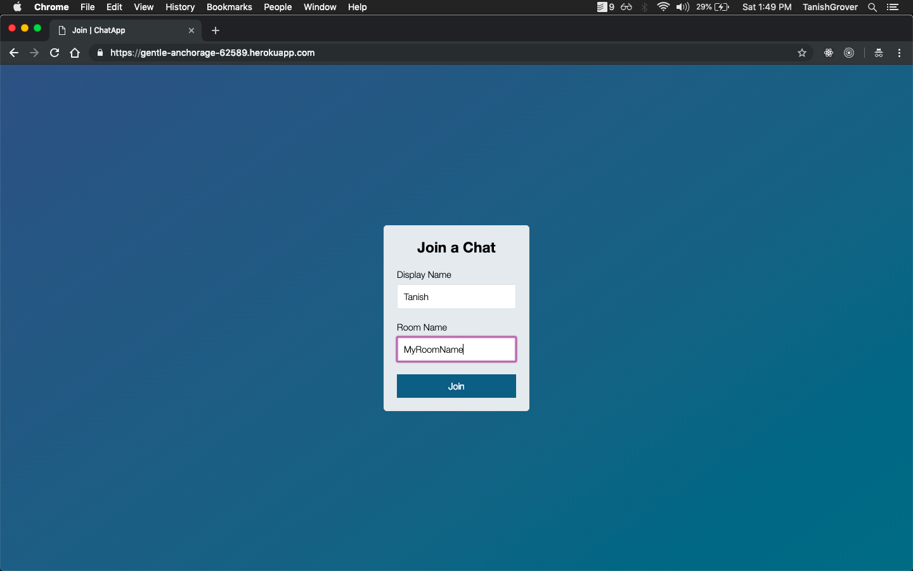
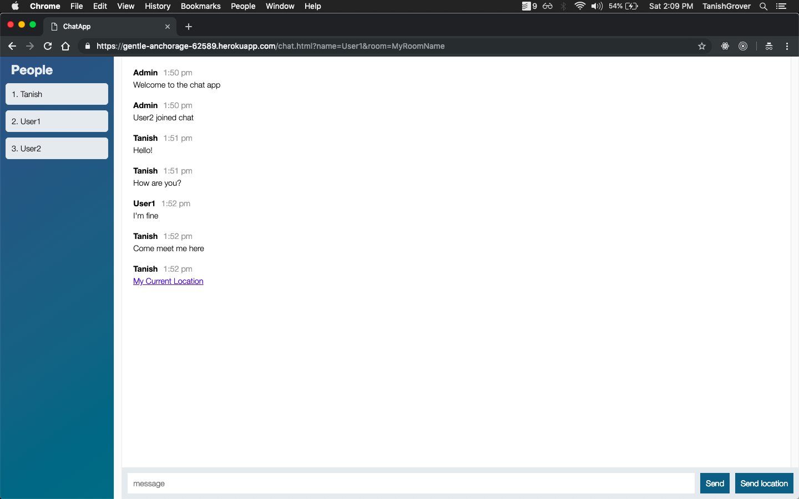
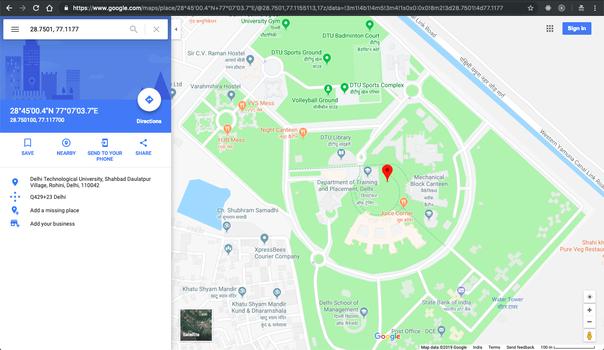

# socketio-chat-app
A chat application made using socket.io. Allows users to create different chat rooms to chat with their friends.
Try [here!](https://gentle-anchorage-62589.herokuapp.com)
 

## Getting Started
` npm install `

` npm run start `

Go to localhost:3000
 

## Demo
###### Enter username and room name.
 

  

###### Chat window
 

  

 

###### Send current location
 

  

 

